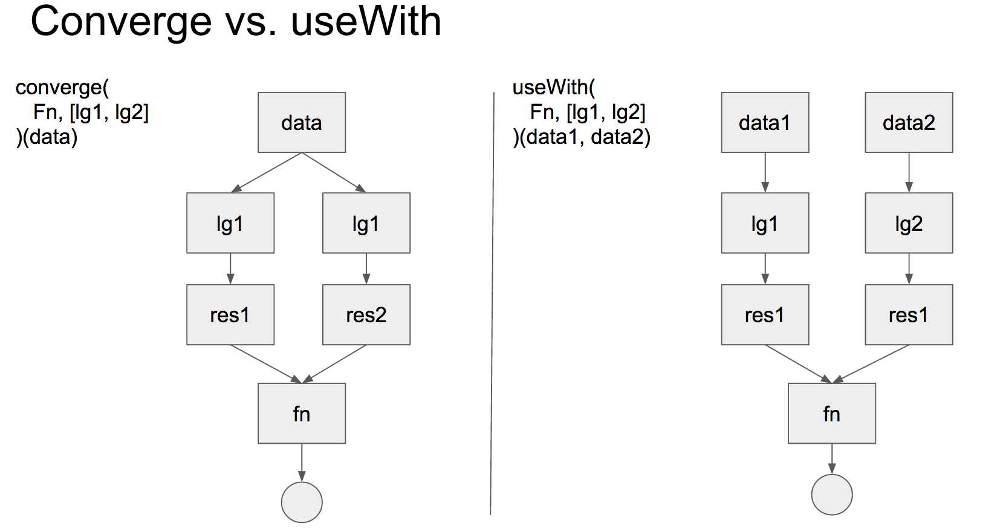

## Point-free 

So what is Point-free function.
Take a look this example:

```
const getUpdatedPerson = (person) => R.assoc('avatar', getUrlFromPerson(person), person);
```
To make it as point-free function, we need to get rid of `person` object we pass into the function.

First way, we can use `R.converge`:
```
const getUpdatedPerson = R.converge(
    R.assoc('avatar'),
    [
        getUrlFromPerson,
        R.identity
    ]
)
```

More detail check [part1](converge.js) and [part2](converge2.js)

Second way is to use `R.useWith`:
```
const countries = [
    {flag: 'GB', cc: 'GB'},
    {flag: 'US', cc: 'US'},
    {flag: 'CA', cc: 'CA'},
    {flag: 'FR', cc: 'FR'}
];

const getCountry = useWith(
    find,
    [
        propEq('cc'),
        identity
    ]
);

const result = getCountry('US', countries);

console.log(result);
```

So what is the difference between `R.converge` & `R.useWith`?
Remember this:

* Rule1: if there is only one arg, consider use `R.converge`.
* Rule2: if there are multi args, consider use `R.useWith`


